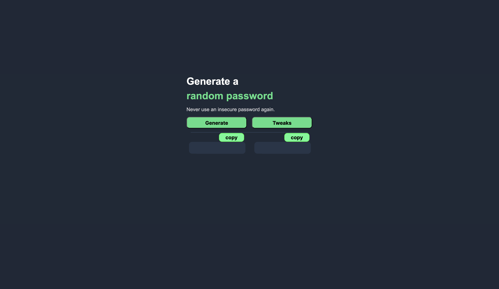
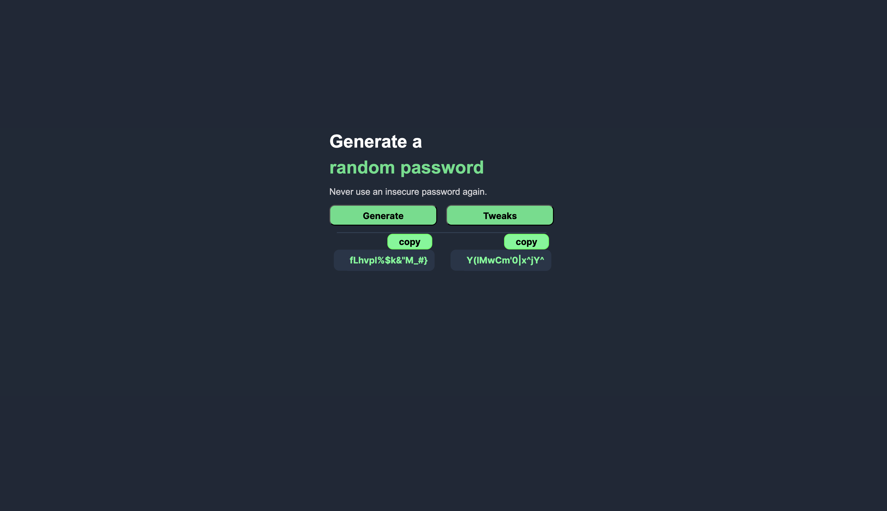
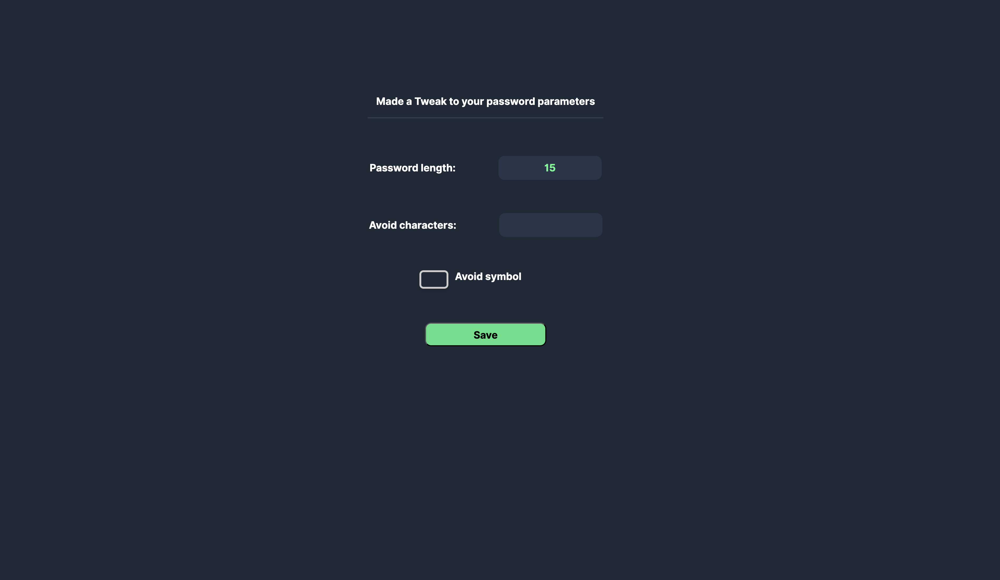

# Random Password Generator

**A clean and simple password generator web app that gives you **two strong random passwords** instantly!**

---

## Features

- No logs - Generates entirely on your ***browser****
- Generates 2 random passwords every time you click the **"Generate"** button
- Tweaks option to customize what your password should contain and what not
- Widely acceptable password across all sites
- Strong algorithm to generate strong passwords
- Always gives different results — great for keeping things secure
- One-click **copy** feature to grab your password instantly
- Super minimal and easy to use literally 2 clicks

---


## Sample
### Generation UI


### After Passwords are Generated


### Password Tweaks UI


---

## File structure
```
      ├── web-passwordgenerator-project
      │   │── assests -> (dir) Contains Screenshots of UI
      │   ├── favicon_io 
      │   │   ├── *site favicons assets
      │   │   └── site.webmanifest
      │   │
      │   ├── index.html
      │   ├── index.css
      │   └── index.js
      │
      └── README.md
```

---

## How To Use

1. **Use Free online hosted site**:
   [Click Here](https://web-random-password-generator-tojt.vercel.app/)
   
2. **Clone or Download** this repo to self host:

   **Step 1:** Get it in your system

   In terminal us below command
   ```bash
   git clone https://github.com/ravikishore23/random-password-generator.git
   ```
   Or
   Download [link](https://github.com/ravikishore23/Web-Random-Password-Generator)

   **Step 2:** Open file

   If downloaded with link unzip it
   then navigate to index.html

   **Step 3:** Open with browser

   Right click on index.html and choose open in browser

   ***Now you can enjoy using it locally!***

